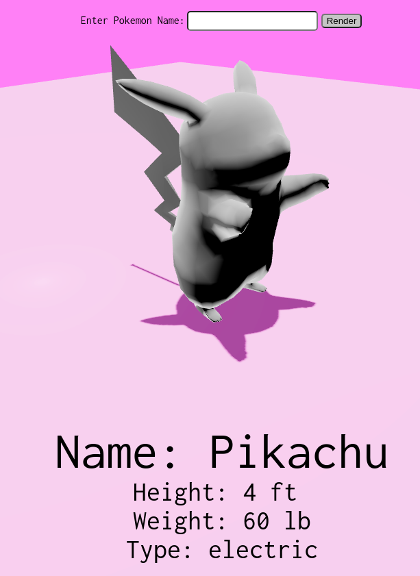

# PokemonBoxing

## About
*****

Displays a 3d model of any of the first gen pokemon as well as some info about the pokemon.



## Tech Stack
*********


## Version Control
**********


## Getting Started
**********

cd into client directory
```
npm i
```
```
npm start
```

## Future Improvements and Functionality
********

All 3d models are stored client side, making it very slow to load initally. Moving the models to a DB and then making a call would be better for inital render times.

The information on the Pokemon will have more info displayed as the info is taken form the public pokemon database.
